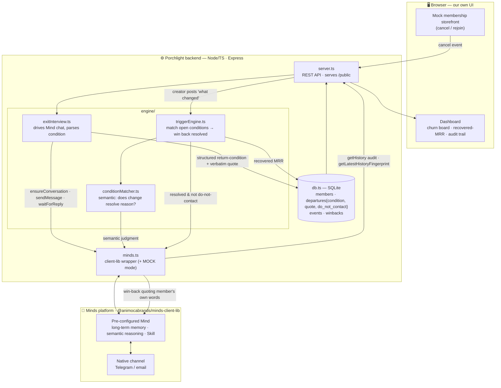

<div align="center">
  <a href="https://porchlight.edycu.dev"></a>

  <h1>Porchlight 🏮</h1>
  <p><em>An exit-interview Mind that remembers <b>why</b> each member left — and autonomously wins them back the moment their reason is actually fixed</em></p>

  <a href="https://porchlight.edycu.dev"></a>

  <br/>

  [](https://porchlight.edycu.dev)
  [](https://youtu.be/1J-86tHxsYM)
  [](https://porchlight.edycu.dev/pitch-deck/)
  [](https://hellominds.ai)
  [](https://dorahacks.io/hackathon/creativeminds)
  [](https://dorahacks.io/hackathon/creativeminds)
  [](https://build.hellominds.ai)

  <br/>

  
  
  
  
  
  
  
  
  
  [](https://github.com/edycutjong/porchlight/actions/workflows/ci.yml)
  [](https://github.com/edycutjong/porchlight/actions/workflows/codeql.yml)
  [](https://github.com/edycutjong/porchlight/releases)

</div>

### 🤝 Sponsor

Porchlight is built on **[Minds by Animoca Brands](https://hellominds.ai)** — the sponsor platform for the Creative Minds Jam. The Minds agent is the **engine**, not a wrapper: per-member long-term memory, semantic reasoning, and native-channel outreach all come from the Mind via [`@animocabrands/minds-client-lib`](https://build.hellominds.ai). Builder console: [build.hellominds.ai](https://build.hellominds.ai).

Track: *Audience growth & community engagement*.

---

## ⚠️ The problem
For any membership creator, **churn is the direct revenue wound.** When a member cancels, the *reason* vanishes — nobody records it. And when the creator later fixes the very thing that drove people away (resumes a series, drops the price, ends the drama), the people who left for exactly that reason are never told. Today's "win-back" is a generic *"we miss you"* blast that ignores why each person actually left.

## 🏮 What Porchlight does
1. **Exit interview (memory).** A member cancels → the Mind runs a short, warm interview and files a structured **return-condition** per member — the reason, in *their own words*.
2. **Churn board (continuity).** Every departure compounds into a live board: *"33% left over the pivot away from deep-dives."*
3. **Conditional win-back (autonomous follow-up).** The creator announces what changed → the Mind **semantically matches** it against every stored reason and, unprompted, messages **only** the members whose reason is now resolved — **quoting their own words** from weeks ago. Do-not-contact is always honored. Recovered MRR is tracked.

## 🧠 Why the Mind is the product (not a wrapper)
- The **exit interview** is an adaptive conversation, not a form.
- **Condition matching** is *semantic judgement* — "the pivot to short clips" is resolved by "deep-dives are back" even with **zero shared keywords**. That is the Mind reasoning, not a filter.
- The **win-back** recalls the member's *own words* from months earlier — the Mind's long-term memory.
- Remove the Mind and there is neither the memory nor the trigger. A stateless tool can send "we miss you"; it cannot know *this* person left for *that* reason and that reason is now fixed.

Uses `@animocabrands/minds-client-lib` across 7 methods: `listMinds`, `getMind`, `ensureConversation`, `sendMessage`, `waitForReply`, `getHistory`, `getLatestHistoryFingerprint`.

## ⚡ Run it

```bash
npm install
npm run demo  # the full arc, headless (works offline in MOCK mode)
npm start     # dashboard at http://localhost:5173  (npm run seed first for data)
npm test      # 51 tests (interview parse, win-back, semantic edge, do-not-contact, live SDK, edges)
```

### Offline by default, real Mind when you want it
With no API key, Porchlight runs in **MOCK mode** so the whole flow is demoable offline. To drive a real Mind:

1. Create a Mind at [hellominds.ai](https://hellominds.ai).
2. Author the **Porchlight** Skill by describing it to your Mind:
   > *"When I forward a cancellation, run a short warm exit interview and reply with a JSON return-condition `{reasonCategory, detail, verbatimQuote, doNotContact}`. Later, when I tell you something changed, tell me which past cancellers that resolves and draft a personal win-back quoting their own words."*
3. Create a Builder API key in the [Builder console](https://build.hellominds.ai).
4. `export MINDS_BUILDER_API_KEY=…` (optionally `MIND_ID=…`), then `npm run spike`.

## 🏗️ Architecture

- `src/minds.ts` — the Minds integration (LIVE client-lib + MOCK brain).
- `src/engine/` — exit interview, condition matcher, trigger engine.
- `src/board.ts` — the churn-intelligence board. `src/server.ts` + `public/` — dashboard.

Node 22+ · TypeScript · Express · zod. A JSON store mirrors the Mind's memory for the board and audit trail; the Mind remains the semantic brain.

## 🧪 Testing & CI

A production-grade harness runs on every push and PR — a **6-stage GitHub Actions pipeline** (`ci.yml`): Quality → Security → Build & Smoke → E2E → Performance → Deploy Gate. Releases run in a dedicated `release.yml` workflow (see below).

```bash
npm run ci          # audit + strict typecheck + unit tests
npm test            # 51 unit tests (node:test)
npm run test:coverage  # 100% lines / branches / functions on every source file
npm run e2e         # Playwright E2E against the live dashboard (demo mode, no key)
npm run lighthouse  # Lighthouse CI (performance / a11y / SEO)
make security-scan  # npm audit + license check
```

### Automatic semantic versioning

Version numbers are never bumped by hand. On every push to `main`, the `release.yml` workflow runs **[semantic-release](https://github.com/semantic-release/semantic-release)**: it reads the [Conventional Commits](https://www.conventionalcommits.org/) since the last tag, computes the next [SemVer](https://semver.org/), then — with no manual release PR — writes `CHANGELOG.md`, bumps `package.json`, tags the commit, and publishes a GitHub Release automatically.

| Commit prefix | Release |
|---|---|
| `fix:` | patch — `0.1.0 → 0.1.1` |
| `feat:` | minor — `0.1.0 → 0.2.0` |
| `feat!:` / `BREAKING CHANGE:` footer | major — `0.1.0 → 1.0.0` |
| `chore:` `docs:` `test:` `ci:` `refactor:` | no release |

Commit conventionally and the version takes care of itself.

| Layer | Tool | Status |
|---|---|---|
| Code Quality | TypeScript **strict** (`tsc --noEmit`) | ✅ |
| Unit Testing | `node:test` — core Mind flow + engine, DB, server, live-SDK & edge cases | ✅ (51 · 100% coverage) |
| E2E Testing | Playwright — demo-mode smoke, win-back flow, responsive | ✅ (3 specs × 2 browsers) |
| Security (SAST) | CodeQL | ✅ |
| Security (SCA) | Dependabot + `npm audit` | ✅ |
| Secret Scanning | TruffleHog (CI) | ✅ |
| Performance | Lighthouse CI | ✅ (advisory) |
| Versioning | semantic-release (Conventional Commits → SemVer) | ✅ |

## 📄 License
[MIT](LICENSE) © 2026 Edy Cu

## 🙏 Acknowledgments
Built for the **Creative Minds Jam** (Minds by Animoca Brands). Thank you to the Minds team for the `@animocabrands/minds-client-lib` builder surface.
